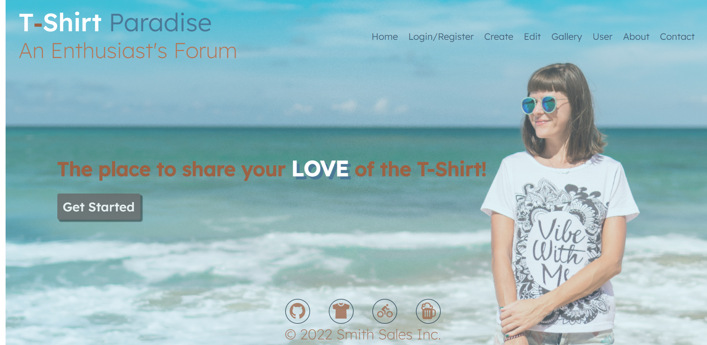
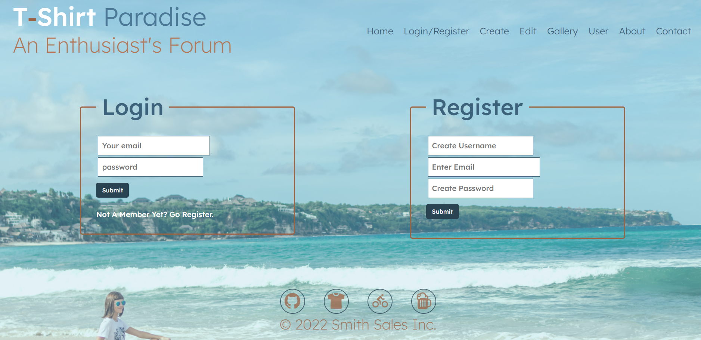
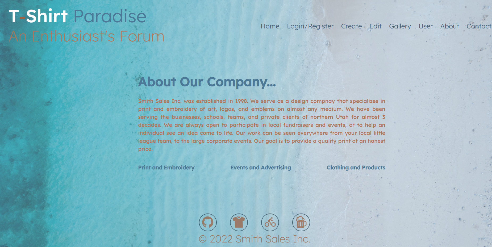

# T-Shirt Paradise
### Brought to you by: Smith Sales Inc.

------------------------------------------------------------------

## Description
This application is a forum for T-Shirt enthusiasts to connect with others that have the same passion.  It allows users to create an accounts where they can upload some of their favorite T-Shirts or even express themselves by creating their own artistic T-Shirt mockup. Users can also view other's T-Shirts and provide comments on their thoughts.  It is a t-shirt lovers paradise!

## Deployed Link

 https://t-shirt-paradise.herokuapp.com/

## Technologies Used

* React
* Node.js
* Express.js
* MongoDB / Mongoose
* GraphQL

## Table of Contents

* [Installation](#installation)
* [Usage](#usage)
* [Contributions](#contributions)
* [License](#license)
* [Questions](#questions)
* [Preview](#preview)

## Installation

No installation is required.

## Usage

Simply follow the website URL. If you are a first time user you will need to create an account or login if you are a member. You will then be presented with options to create a T-Shirt display with your favorite T, or create a mock up version of a t-shirt idea living in your head.  You'll also have the option to view a gallary of shirts and comment on those you find the most interesting.

## Contributions:

* Alexandros Vlamakis
* Berke Forbes
* Taylor Cannon
* Scott Nichols

## License

 [Link to MIT License Details](https://choosealicense.com/licenses/mit/)

---

## Tests

No tests 

## Questions
If you have questions:
* [Github](https://github.com/Sessions21/t-shirt-paradise)
* [Email](mailto:s21nichols@hotmail.com) 

## Preview

